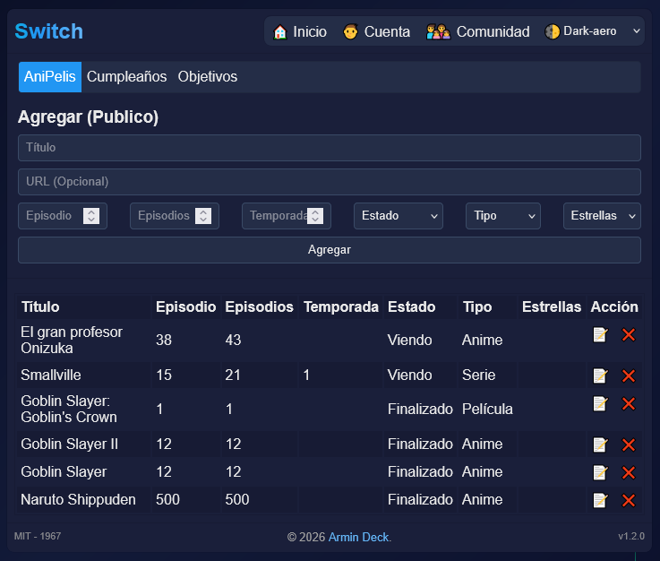

# Switch
Aplicación web PHP moderna y versátil para gestionar múltiples aspectos de tu vida digital. Switch permite administrar una colección de contenido multimedia (anime, películas, series, etc.), mantener un diario personal, gestionar objetivos, crear notas y conectar con una comunidad. Con soporte multiidioma, múltiples temas visuales y autenticación de usuarios, ofrece una experiencia personalizable y completa.

## 🚀 Características principales  
- **Gestión de contenido multimedia** - Agregar, modificar y eliminar anime, películas, OVAs y otros tipos de contenido
- **Autenticación de usuarios** - Sistema de registro e inicio de sesión seguro
- **Cuentas personalizadas** - Cada usuario puede crear su propio listado personalizado
- **Soporte multiidioma** - Interfaz disponible en español e inglés
- **Múltiples temas visuales** - Cambio dinámico de temas incluyendo temas oscuros y especiales (Cyberpunk, Matrix, etc.)
- **Sistema de notas y diario** - Crear y gestionar notas personales con registro por fecha
- **Gestión de objetivos** - Crear y seguimiento de metas y tareas
- **Registro de cumpleaños** - Base de datos de fechas especiales
- **Comunidad** - Sección para interactuar con otros usuarios
- **Interfaz responsiva** - Compatible con dispositivos móviles y de escritorio
- **Almacenamiento en JSON** - Configuración y datos almacenados en archivos JSON

## 📑 Secciones disponibles
- **Inicio** (Home) - Página principal
- **Login** - Iniciar sesión
- **Registro** - Crear nueva cuenta
- **Perfil** - Información del usuario
- **Diario** - Notas personales por fecha
- **Notas** - Listado de notas
- **Objetivos** - Gestión de metas y tareas
- **Cumpleaños** - Registro de fechas de nacimiento
- **Comunidad** - Sección de comunidad

## ⚙ Configurar hCaptcha
- Agregar la clave secreta y publica en [config.json](./database/config.json)

## 🎲 Créditos y dependencias

Este proyecto utiliza [PHP Markdown Lib](https://github.com/michelf/php-markdown)
(c) 2004–2022 Michel Fortin — Licencia BSD (basada en Markdown por John Gruber).

## 🌐 Información adicional  
🔗 Página oficial: [dbproject.rf.gd](https://dbproject.rf.gd)  
