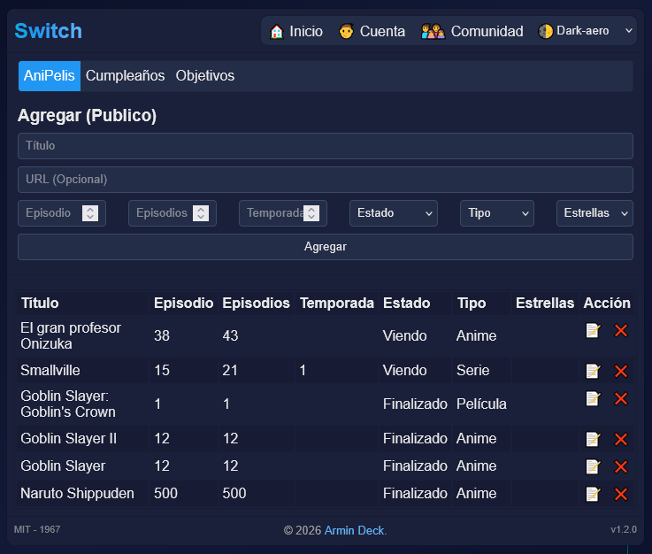

# Switch Blog
Switch Blog es una plataforma web hecha en PHP orientada a la publicación de artículos y contenido editorial. Está pensada como un blog moderno con un panel de administración para crear publicaciones, gestionar borradores, personalizar la apariencia y administrar la configuración del sitio.

## 🚀 ¿Qué es este proyecto?
Switch Blog nace como una base para un sitio de blog personal o editorial, con enfoque en:
- publicar artículos con estructura clara,
- mostrar contenido en formato web moderno,
- ofrecer un dashboard para administrar el sitio,
- y extender la plataforma con nuevas funciones en el futuro.

## ✨ Características principales
- Publicación de artículos con título, resumen, categoría, imagen y contenido
- Soporte para Markdown en el contenido de los posts
- Gestión de artículos publicados y borradores
- Sistema de usuarios con registro, inicio de sesión, recuperación de contraseña y perfil
- Sistema de likes en publicaciones
- Dashboard para crear, editar y administrar artículos
- Configuración general del sitio, idioma, tema y zona horaria
- Integración con hCaptcha para proteger formularios
- Almacenamiento de datos en archivos JSON
- Soporte multiidioma y múltiples temas visuales

## 🧠 Panel de administración
El dashboard está pensado para convertirse en el centro de control del blog. Actualmente incluye:
- creación y edición de artículos,
- gestión de borradores,
- configuración básica del sitio desde la interfaz,
- configuración de hCaptcha y SSL,
- y administración del perfil del usuario.

> La configuración general del sitio puede gestionarse desde el panel administrativo, sin necesidad de editar manualmente el archivo [database/config.json](./database/config.json).

### Próximamente / en desarrollo
- subida de archivos e imágenes,
- gestión avanzada de usuarios,
- administración de anuncios,
- y más herramientas de control para el blog.

## 📑 Secciones principales
- Inicio
- Blog
- Dashboard
- Perfil
- Configuración
- Login / Registro / Recuperación de cuenta

## ⚙ Requisitos
- PHP 8 o superior
- Apache con mod_rewrite habilitado
- XAMPP, LAMPP u otro entorno web compatible

## 🛠 Instalación
1. Copia el proyecto en la carpeta pública de tu servidor.
2. Asegúrate de que la carpeta tenga permisos de escritura para los archivos JSON.
3. Configura el sitio para usar [index.php](./index.php) como punto de entrada.
4. Ajusta la configuración básica desde el panel administrativo o, si lo prefieres, edita manualmente [database/config.json](./database/config.json).
5. Si usas URLs amigables, activa el módulo Rewrite de Apache.

## 🔐 Configurar hCaptcha
Puedes agregar la clave pública y privada desde el panel administrativo o editando manualmente [database/config.json](./database/config.json).

## 🎲 Créditos y dependencias
Este proyecto utiliza [PHP Markdown Lib](https://github.com/michelf/php-markdown)
(c) 2004–2022 Michel Fortin — Licencia BSD (basada en Markdown por John Gruber).

## 🌐 Información adicional
🔗 Página oficial: [dbproject.rf.gd](https://dbproject.rf.gd)  
